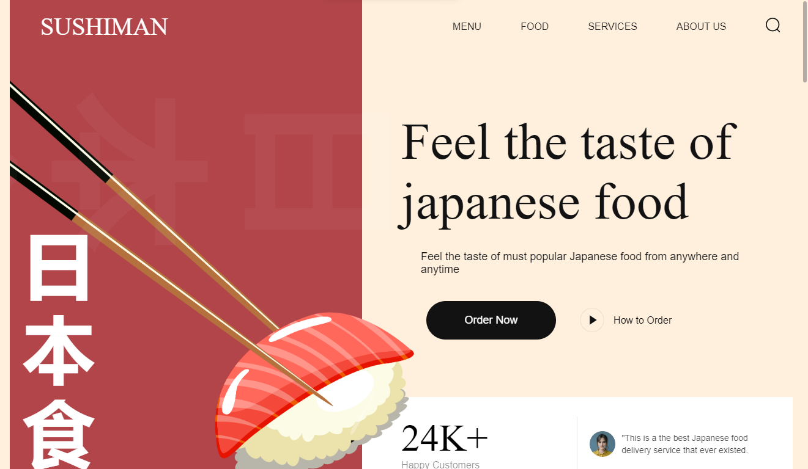

# JAPAN SUSHI WEBSITE

## About Project.

UI Design Project: Sushi Presentation Page
This UI design showcases a presentation page dedicated to the world of Japanese sushi. 
It offers an immersive visual experience, highlighting the beauty and delicacy of sushi. 
The design captures the essence of Japanese cuisine while providing a user-friendly 
interface to explore the art of sushi. Explore this project to discover a creative UI design that celebrates Japanese gastronomy

#### Development Method: BEM
#### Animation Lib: AOS Animate
#### Project Build with: HTML CSS & JS

Projet de Conception UI : Page de Présentation de Sushis
Cette conception UI présente une page de présentation dédiée à l'univers des sushis japonais. 
Elle offre une expérience visuelle immersive, mettant en valeur la beauté et la délicatesse des sushis. 
La conception capture l'essence de la cuisine japonaise tout en offrant une interface utilisateur conviviale pour explorer 
l'art du sushi. Explorez ce projet pour découvrir une conception UI créative qui célèbre la gastronomie japonaise.
#### Methode de Developpement: BEM
#### Animation Lib: AOS Animate
#### Project Build with: HTML CSS & JS
